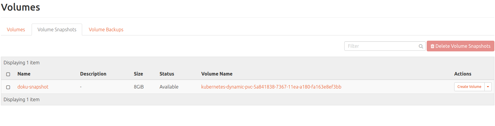

# Kubernetes PVC Snapshots

## Overview

You can take a snapshot of a running Kubernetes pvc volume in OpenStack and use it as a backup for the volume or you can even export it as an
image and export that image to another pod.

## Snapshot Process

Here are some notes I have on taking a snap shot of pvc in Kubernetes.

1. Install a Helm chart that uses a pvc.  We'll use bitnami/dokuwiki as
and example.
2. You'll have a PVC that looks something like this:
```
root@node-1:~# kub get pvc -n doku
NAME                     STATUS    VOLUME                                     CAPACITY   ACCESS MODES   STORAGECLASS   AGE
doku-dokuwiki-dokuwiki   Bound     pvc-5a841838-7367-11ea-a180-fa163e8ef3bb   8Gi        RWO            standard       46s
```
3. Now you can take a snapshot of this PVC from Horizon:


4. Now create a new volume from the snapshot.



5. If you want to off load the snapshot to another pod this is the time to do it.

+ Create an image from the volume BEFORE it is mounted.
+ The image can be moved to another Open Stack pod or it can be used by
another project if it's shared.
+ If you migrate to another pod a volume can be create from the image.

```
Admin tip:
To make an image in a project public run this as admin from the pod controller.

openstack image set doku-snapshot-image --public

```

6. Next mount the new volume to a node.


7. Create a new pv.yaml file for the volume.

+ Make sure the pv points to the correct volume ID in Open Stack.
+ Run kubectl apply -f pv.yaml

[deployments/pv.yaml](deployments/pv.yaml)


8. Create a new pvc.yaml file to point to the pv.

+ Make sure the pvc points to the correct pv.
+ Run kubectl apply -f pvc.yaml

[deployments/pvc.yaml](deployments/pvc.yaml)


9. Update the deployment to use the new pvc.  The kubernetes pod will automatically recreate when you save it.

```
      volumes:
      - name: dokuwiki-data
        persistentVolumeClaim:
          claimName: doku-pvc   # this is the name I used for the new pvc

```

9. The kubernetes pod will now be using the new volume.

+ If you are dealing with a stateful set you will have to delete the existing pvc and use the exact
same name when creating your new pvc(s).  The stateful sets have a predictable pvc name so this is why you have to delete
the existing pvc first.  Delete the running pods and the new ones will automatically mount to the new pvc(s).
