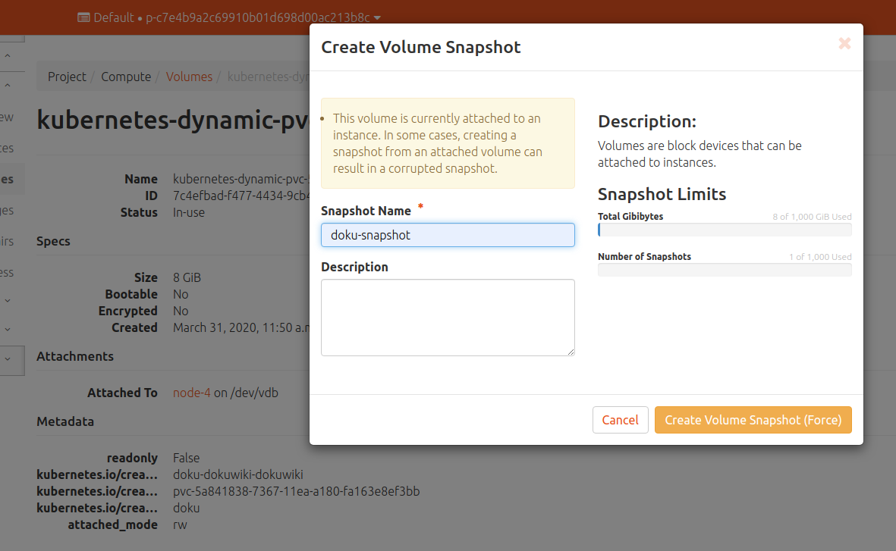

# Kubernetes PVC Snapshots

## Overview

You can take a snapshot of a running Kubernetes PVC volume in OpenStack  
and use it as a backup for the volume or you can even export it as an  
image and export that image to another pod.

## Snapshot Process

Here are some notes I have on taking a snap shot of PVC in Kubernetes.

1. Install a Helm chart that uses a PVC.  We'll use bitnami/dokuwiki as
and example.
2. You'll have a PVC that looks something like this:
```
root@node-1:~# kub get pvc -n doku
NAME                     STATUS    VOLUME                                     CAPACITY   ACCESS MODES   STORAGECLASS   AGE
doku-dokuwiki-dokuwiki   Bound     pvc-5a841838-7367-11ea-a180-fa163e8ef3bb   8Gi        RWO            standard       46s
```
3. Now you can take a snapshot of this PVC from Horizon:

